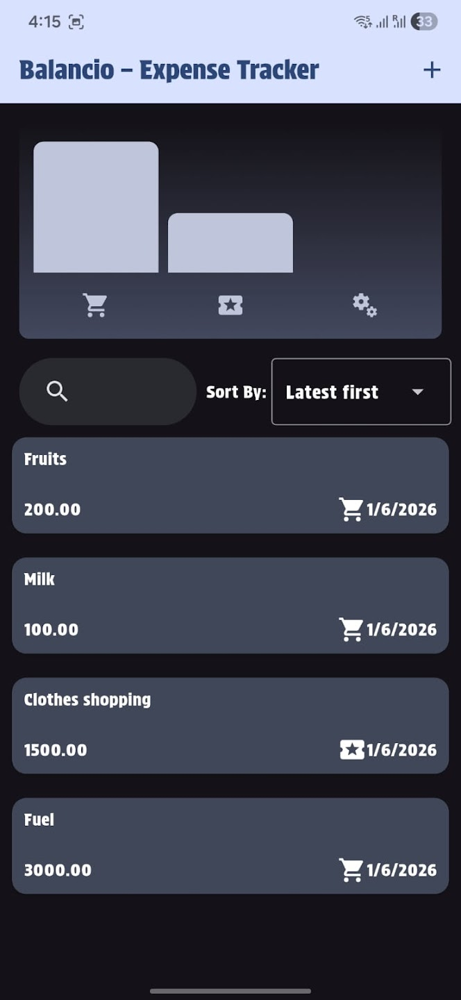

# Expense Tracker

A production-ready expense tracking app built with Flutter, featuring Firebase backend integration and a scalable architecture.

🔗 **Download on Play Store:**  
https://play.google.com/store/apps/details?id=com.ashishapps.money360

---

## 🚀 Features

- Add and manage daily expenses
- Categorize transactions (e.g., Essential, Non-essential)
- Track total spending and summaries
- User authentication using Firebase
- Cloud-backed data storage using Firestore
- Clean and intuitive UI

---

## 🏗️ Architecture

The project follows a structured and scalable architecture:

- Presentation → UI + ViewModels
- Domain → Business logic (Usecases)
- Data → Repository + Firebase backend

**Data Flow:**  
UI → ViewModel → Usecase → Repository → Firebase

---

## 🧰 Tech Stack

- Flutter (UI)
- Provider (State Management)
- Firebase (Authentication + Firestore Database)
- Clean Architecture (MVVM + Repository Pattern)

---

## 📱 Screenshots

| Dashboard | Editor |
|----------|--------|
|  |  |

---

## ⚙️ Setup

1. Clone the repository
2. Run `flutter pub get`
3. Configure Firebase
4. Run the app

---

## 🔮 Roadmap

- Improve analytics and insights
- Add export/import functionality
- Implement daily reset logic
- Add monthly reports and summaries

---

## 💡 Key Learnings

- Built and deployed a production Flutter app on Play Store
- Integrated Firebase Authentication and Firestore for scalable cloud data storage
- Migrated from local storage (Hive) to cloud backend (Firestore) for better scalability
- Applied structured architecture for clear separation of concerns
- Managed application state effectively using Provider  